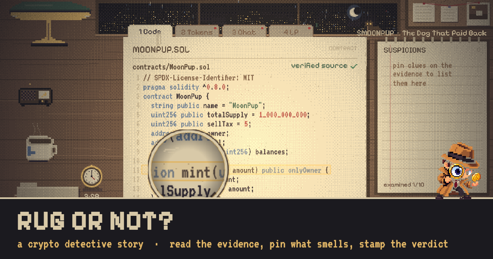
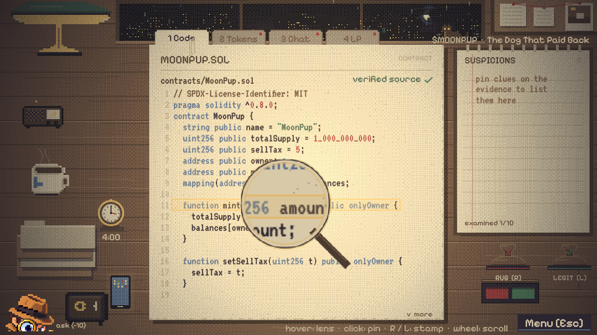
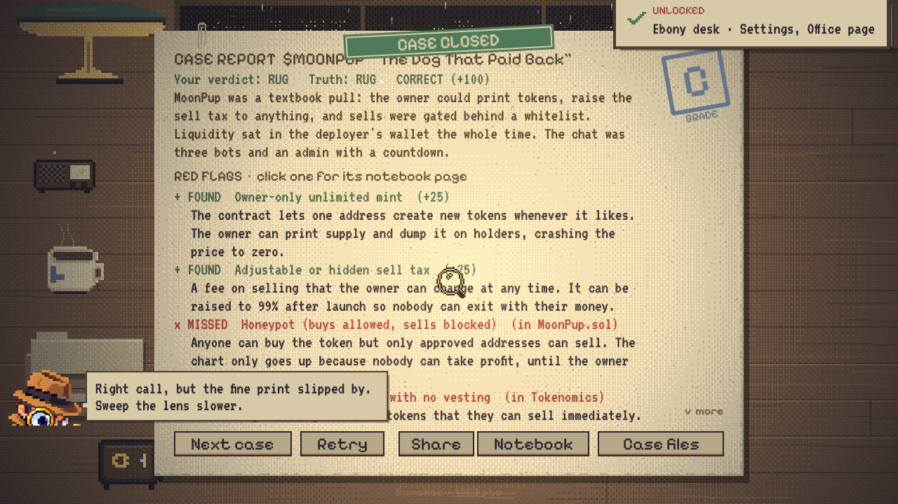
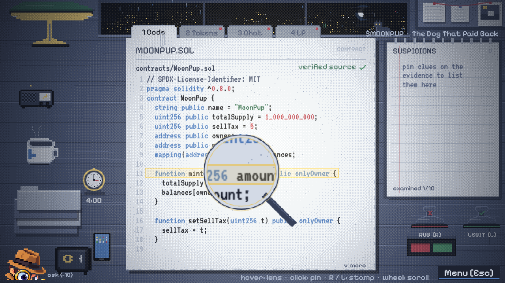
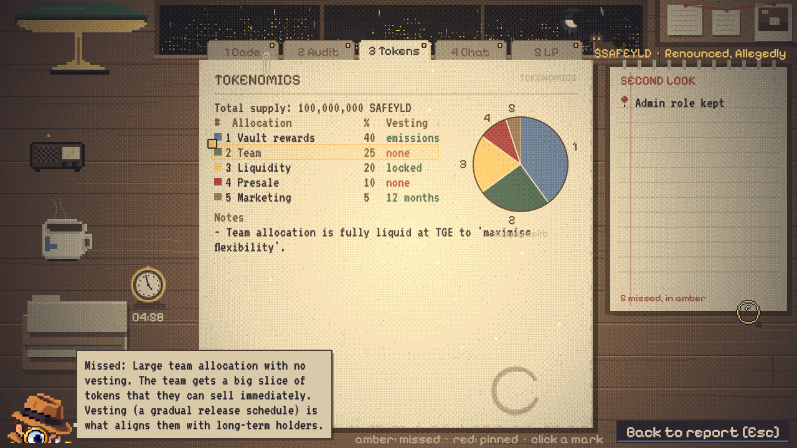
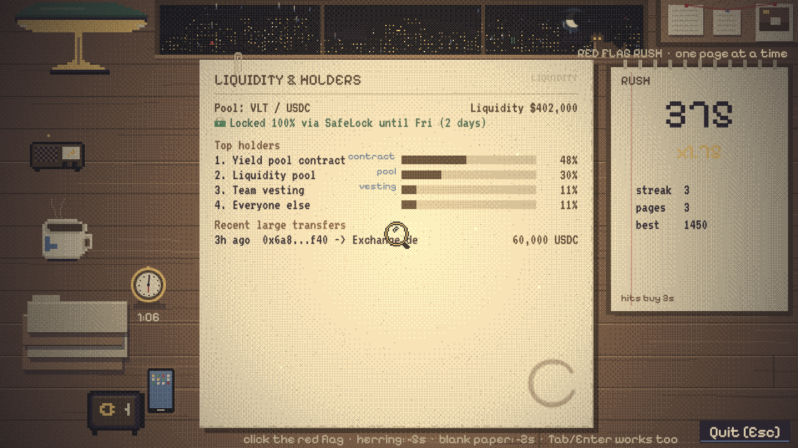
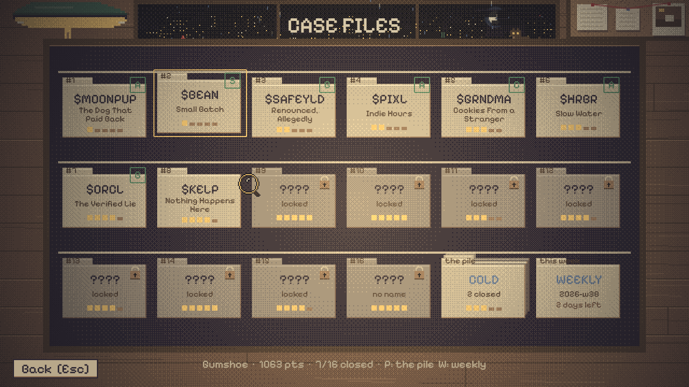
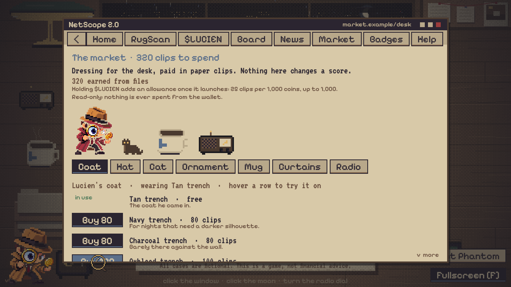
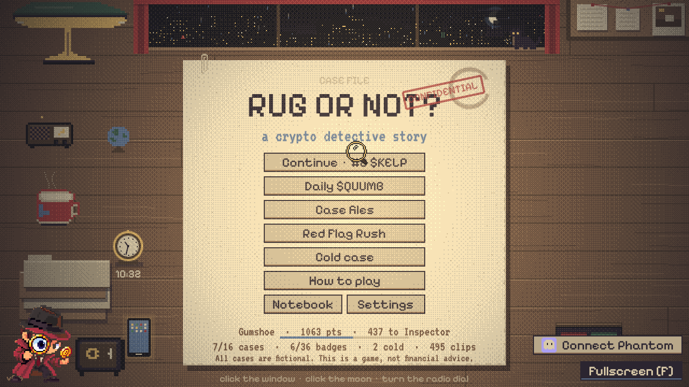
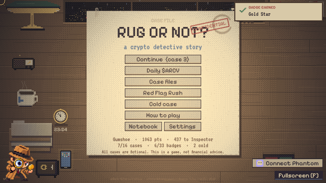

# Rug or Not?



**Play:** https://elooouan.github.io/rug-or-not/ (once GitHub Pages is enabled, see below) ·
**Follow:** [@0xRugOrNot](https://x.com/0xRugOrNot) · **Write a case:** `/editor.html` on the
same host · **Show it to someone:** [docs/DEMO.md](docs/DEMO.md).

A pixel-art noir detective game about spotting crypto scams, with Detective Lucien as your guide. Each case is a folder of
evidence on your desk: a contract snippet, tokenomics, a team page, a community chat log,
a liquidity report and sometimes an audit certificate. Read it through the magnifying
glass, pin the suspicious bits, stamp a verdict (**RUG** or **LEGIT**), and read the report.
It plays in a desktop browser or on a phone held sideways (the lens floats above your
finger; add the page to the home screen for a full-screen desk).

> All cases, tokens, people and projects are fictional. This is a game, not financial advice.

| The lens                                                                          | The report                                                | Blue hour                                                                                   |
| --------------------------------------------------------------------------------- | --------------------------------------------------------- | ------------------------------------------------------------------------------------------- |
|  |  |  |

| The second look                                                                         | Red Flag Rush                                                                 | The drawer                                                     |
| --------------------------------------------------------------------------------------- | ----------------------------------------------------------------------------- | -------------------------------------------------------------- |
|  |  |  |

| The market                                                                    | The desk, dressed                                                                                 |
| ----------------------------------------------------------------------------- | ------------------------------------------------------------------------------------------------- |
|  |  |



## Run it

Requires Node 20.9+ (Vite 6 / Vitest 3 are pinned for Node 20; Vite 8 needs Node 20.19+).

```bash
npm install
npm run dev        # http://localhost:5173
```

Other scripts:

| Script                   | What it does                                         |
| ------------------------ | ---------------------------------------------------- |
| `npm run build`          | Typecheck + production build into `dist/`            |
| `npm run preview`        | Serve the production build locally                   |
| `npm test`               | Vitest: scoring, rush, generator, save, cases, board |
| `npm run validate-cases` | Validate every case file and print a summary         |
| `npm run e2e`            | Playwright smoke tests (dev server + built bundle)   |
| `npm run lint`           | ESLint                                               |
| `npm run format`         | Prettier                                             |

Shipping a version (checks, tag, release notes, Pages, launch env) is written up in
[docs/RELEASE.md](docs/RELEASE.md); the demo script is [docs/DEMO.md](docs/DEMO.md).

`index.html` carries Open Graph / Twitter card tags pointing at `public/img/og.png` on the
GitHub Pages URL; change those absolute URLs if the game moves to another host.
Production builds register a small network-first service worker (`public/sw.js`) so the game
keeps working offline after one visit. The game is a static site: deploy `dist/` anywhere (paths are relative, so it works
from a sub-folder). A GitHub Pages workflow is included in
`.github/workflows/deploy.yml`: enable Pages (Settings → Pages → Source: _GitHub Actions_)
and run the workflow from the Actions tab, or change its trigger to `push` to deploy on
every commit. CI (`.github/workflows/ci.yml`) runs lint, typecheck, case validation, tests
a build and Playwright smoke tests (boot, a full case, deep links, the editor, a fake Phantom
connecting read-only) on every push.

## Meet Detective Lucien

The mascot pops up Pokémon-trainer style with once-only guidance: the title intro, opening
the first folder, using the lens, pinning, switching tabs, stamping, reading the report, the
notebook, the daily case. Hints can be switched off or replayed in Settings. Source art lives
in `assets/`; the transparent in-game PNGs are in `public/img/`.

## The desk is alive

Hover the coffee to take a sip. Click the lamp (it has feelings after ten clicks), the window
(cycles the weather: rain, thunderstorm, snow, clear night, fog), the moon, the curtains
once the market has hung some (they draw across the glass and open again), the corkboard
(real detective tips), the folder stack, the ink pad (inks your cursor), the clock, and
Biscuit the cat on the sill. The title card has a few typed-word and Konami surprises (try
"shop" or "clips"), and the
version number hides the credits. There is also a floor safe with a three-digit combination
(the notebook counts the answer) holding the developer's ledger, and a radio under the lamp
that tunes between lo-fi, late jazz, static and off; sit with the static long enough and
you'll hear a numbers station tapping the combination in morse. Badges track all of it (NetScope > Badges).
The desk is yours to dress, too: files pay paper clips, and the market on the phone spends
them on Lucien's coat and hat, the cat's fur, the mug, the radio, curtains and an ornament
for the corner (a bobblehead that nods, a fish named Liquidity). And to arrange: "Arrange
desk" on the title (or Settings > Office, or type `desk`) dims the lamp, slides the paperwork
off and puts a handle on every prop. Drag the mug, radio, clock, phone, safe, folders, ink
pad and ornament where you like, cross off what you never touch, put it back from the strip
at the top; nothing can sit under the file, the notebook or the stamps. Ornaments can stand
on extra spots bought with clips (30, 50, 80). The layout (`src/systems/deskLayout.ts`) is
part of the save and every screen draws from it.

## NetScope (the phone)

The phone on the desk opens an in-game browser:

- **RugScan** - an explorer page for the current case (flavour only, never a verdict).
- **The coin** - the "Connect wallet" chip on the title opens this page. Phantom's injected
  provider (Solflare and Backpack work the same way) is used read-only: the game learns your
  public address and reads SOL and token balances over the configured RPC. A wallet you've
  linked reconnects silently on later visits (`connect({ onlyIfTrusted })`), rejected or
  locked wallets get a plain message, and the page warns when the RPC answers for a different
  network than `VITE_SOLANA_CLUSTER`. The game never requests signatures or transactions and
  never sees a seed phrase. Everything holding unlocks goes through one entitlement layer
  (`src/systems/entitlements.ts`, tiers at 1×/5×/10× `VITE_TOKEN_HOLDER_MIN`): tier 1 gives
  the gilded magnifier rim, the `$` mark on the board, the aurora on clear nights and a
  second weekly cold case (the holders' file); tier 2 the mahogany desk; tier 3 the coin-gold
  lamp shade and your tier title on the ID card. The last balance seen is remembered so
  perks survive reloads; `VITE_TOKEN_MOCK_BALANCE` (dev builds only) fakes a balance to try
  all of it before launch. Nothing about scoring changes and nothing needs the coin.
- **Board** - Hall of Detectives. Local by default; set `VITE_LEADERBOARD_URL` to a JSON
  endpoint (`GET ?limit=N&mode=case|rush|cold` returns entries, `POST` accepts one) for a
  shared board. A ready-made Cloudflare Worker lives in
  [`server/leaderboard`](server/leaderboard/README.md) (one KV namespace, free tier, three
  commands to deploy). Pick your arcade-style handle on the page, and save a Detective ID card
  (a PNG with your rank, record and badges) from there. The same page carries the
  detectives board: one row per desk (career score, rank, clips earned, files solved, the
  coin balance the wallet reported), sorted by score or by clips, refreshed after every file
  (`GET ?board=desks&sort=total|clips`, `POST ?board=desks`, keyed by a random id the save
  mints; nothing personal leaves the device beyond the name, the numbers and, if connected,
  the public address).
- **Market** - dressing for the desk, paid in paper clips (`src/systems/clips.ts`): closing a
  file pays 3 (+2 for a first solve, +2 for an S, +1 cold, +2 daily, +3 weekly), a rush 1 per thousand
  points, and holding the coin adds an allowance that follows the balance the wallet reports
  (25 clips per `VITE_TOKEN_HOLDER_MIN` coins, capped at 1,000; read-only, nothing is spent
  from the wallet). The catalogue (`src/data/shop.ts`) has coats and hats for Lucien
  (recoloured from the original sprites in `src/systems/wardrobe.ts`), furs and collars for the cat,
  mugs, radios, curtains and desk ornaments; three items also ask for a holder tier, and
  the day's deal (one item a third off, the same for everyone) is half off for holders.
  Buying redresses every screen that is up. Nothing bought changes a score.
- **News**, **Badges**, **Help**, and a 404 with a cat.

Configure the coin through env vars (see `.env.example`); nothing is hard-coded. `VITE_GOATCOUNTER`
(a GoatCounter site code) adds a cookie-free visit counter to production builds; without it
the game phones nowhere. An optional
`VITE_TOKEN_PRICE_URL` (plain `{price}`, Jupiter or DexScreener JSON shapes) shows a price on
the coin page once a mint is set; it's read-only and cached for a minute.

## Modes

- **Campaign**: fifteen cases in order (nine rugs, six legit, difficulty 1→5); each verdict
  unlocks the next folder. Stamp all fifteen correctly and a sixteenth folder with no name
  turns up in the drawer (`"secret": true` in its JSON keeps it out of the daily pool and
  RugScan until then). Every closed folder keeps its last run: the grade sticker reopens
  that run's report, second look included.
- **Daily Case**: one case chosen deterministically from today's date (same for everyone),
  with a local streak counter. Every other day the daily is a generated file seeded by the
  date instead, so dailies never run dry. Every seventh night in a row earns a streak freeze
  (two at most) that forgives one missed night. Daily plays don't unlock campaign folders.
- **Cold cases**: an endless pile of generated files (`src/systems/caseGen.ts`). Each is built
  from a seed, so a share link (`#cold=<seed>`) brings back the exact same file; every
  generated case passes the same schema as the handcrafted ones (400 seeds are validated in
  the tests). Cold cases unlock notebook pages but keep their own tally and board; they never
  touch the campaign or your rank. Their difficulty grows with the campaign files you have
  solved, or is pinned under Settings ("Printer difficulty"). The drawer ends with "the
  pile" (a fresh cold case) and a WEEKLY folder: the week's cold case, identical for
  everyone, so boards can be compared.
- **Red Flag Rush**: sixty seconds, one evidence page at a time. Every page hides at least
  one red flag; click it to clear the page (+3 s), herrings cost 5 s, blank paper 2 s, streaks
  multiply up to ×3. Fine print is shown inline (no lens). Best score, longest streak and a
  separate top-five live on the Hall of Detectives page.
- **Detective's honour** (hard mode): no nudges from Lucien, no examined counter, no hover
  highlights; every run scores ×1.25 and is starred on the board.
- **Relaxed**: turn off timers in Settings. Reduced motion, lamp flicker, rain and a
  no-magnifier accessibility mode (fine print shown inline with a dotted underline) live there too.
- **Drills**: every red-flag page in the notebook has a "Drill this flag" button: five generated
  pages that all hide that flag, on a gentle clock. Clearing all five logs the drill (Drill
  Sergeant badge for the full set).
- **Herring hunts**: the mirror of a drill. Every yellow-herring page has a "Hunt this herring"
  button: five generated pages that each carry it, and the job is to click the thing that
  only looks bad (red flags on those pages cost seconds). Herring Hunter for the full set.
- **Detective's Notebook**: four chapters. Every red flag you meet in a report unlocks its
  glossary page; every yellow herring you run into fills the "looks scary, is fine" chapter;
  every rug you call correctly pins a WANTED poster (procedural mugshot, charges, reward) in
  the rogues gallery; and the handbook explains how the whole office works, one page per
  subject ("How to play" on the title opens it).
  Flag and herring lines in a report are links straight to the page.
- **The second look**: when a report has a missed flag or a false accusation, a line on it
  reopens the file read-only with the run's pins where they were and every miss marked in
  amber; click a mark and Lucien explains it. Esc brings the report back.
- **The desk opens up gradually** (`src/systems/discovery.ts`): a fresh save sees the folder,
  the daily, the notebook and settings; the drawer, the rush, the pile and the weekly turn
  up after one, two, three and four closed files, each announced once by Lucien. Shared
  links skip the gate.
- **Progress**: everything lives in `localStorage`; Settings can export a save code to the
  clipboard and import one on another device.
- **Unlockables**: cosmetic desk woods, lamp shades, magnifier rims and stamp inks earned by
  rank, cases closed, grades, streaks and flags learned. They never affect gameplay.
- **Office colours**: five palettes for the whole place (Noir, Old file, Blue hour, Newsprint,
  Speakeasy) on the Office page of Settings. Every texture is drawn from the twelve named
  colours in `src/config/palette.ts`, so a theme is twelve new values and a repaint.

## How to play

- **Hover** evidence with the magnifying glass. The lens shows a 2x view; some clues
  (fine print) are only legible through it.
- **Click** a suspicious line/row/message to pin it. Click again to unpin. Pins on empty
  paper count as false accusations.
- **Stamp** RUG or LEGIT by clicking a stamp or dragging it onto the paper.
- Keyboard: `Tab`/arrows cycle clue spots, `Enter` pins, `R`/`L` stamp, `1`–`6` switch
  documents, `PageUp`/`PageDown` or the wheel scroll long documents, `Esc` pauses, `F` toggles
  fullscreen, `M` mutes.
- Rendering: the world is 640×360 pixel-art units drawn on a 2× (3× on retina) canvas so
  sprites stay chunky while text stays sharp; the canvas scales to fit the window.

Marketing stills and GIF clips live in `assets/marketing/` and are regenerated with
`node scripts/promo.mjs` (dev server up); `node scripts/fuzz.mjs [seconds] [seed]` is a
monkey test that clicks (at random, and at real buttons and lines) and types across the game
and reports page errors and leaked overlays; `node scripts/sweep.mjs` plays every file
perfectly and reports anything that doesn't grade S (`SWEEP_INLINE=1` with the lens off,
`SWEEP_LOOK=1` to take the second look on every file too).

Deep links: `#case=<id>` opens a file directly, `#daily` opens today's case, `#cold=<seed>` prints
that cold case, `#custom=<id>` opens a file saved from the editor, `#rush` starts a rush, and
`#market`, `#board` or `#coin` open the title with the phone on that page.
The Share menu on a report or a rush result copies the text (or opens the phone's share
sheet), posts to X or Telegram with a prefilled message, and on reports saves a 1280x720 PNG
card. Dev builds expose `__debug.startCase('kelp')` and `__debug.audioLevels()` in the console.

Scoring lives in [`src/systems/scoring.ts`](src/systems/scoring.ts): +100 correct verdict,
−50 wrong, +25 per real red flag pinned (+10 if it was fine print), −15 per false
accusation, −10 per nudge bought from Lucien (max three), a time bonus in timed mode,
×1.25 in Detective's honour mode, and a letter grade S/A/B/C/D. Your total score is
the sum of your **best** run per case, so replays can't farm points.

## Project layout

```
src/
  main.ts           Phaser boot + integer scaling
  config/           palette.ts (the only colours), layout.ts (all layout numbers), gameConfig.ts
  art/              Procedural placeholder textures (swap for sprite sheets later)
  data/             flags.ts (red flag + herring library), schema.ts (zod), cases/*.json, unlockables.ts
  systems/          Pure logic: scoring, rush, caseGen (cold cases), secretCase, ranks, dailyCase, save,
                    settings, unlocks, badges, hints, leaderboard, wallet (Phantom, read-only), weather,
                    audio (synth SFX, lo-fi + jazz loops, radio static), shareCard, caseLoader
  ui/               Reusable Phaser components: DocumentView + documents/, Magnifier, Stamp, NotebookPanel,
                    DialogueBox (Lucien), BrowserPanel + browser/pages (NetScope), DeskBackground (window, cat, radio, safe…),
                    Vault, StickyNote, Toast, dragScroll…
  scenes/           Boot, Cursor (overlay), Title, CaseSelect, Investigation, Report, Notebook, Settings,
                    Rush (also drills), History (the wall)
scripts/            validate-cases.ts, snapshot.config.ts + photograph.sh (wall photos)
server/leaderboard  Reference Cloudflare Worker for a shared board
tests/              vitest
public/fonts/       Pixelify Sans + VT323 (both SIL OFL, licences included)
```

## Adding a case

1. Copy an existing file in `src/data/cases/` to `NN-my-case.json` (files load in name order,
   which is the campaign order).
2. Fill in `id`, `title`, `ticker`, `pitch`, `difficulty` (1–5), `verdict` (`rug` | `legit`),
   `timeLimitSec`, `documents[]` and a `debrief`.
3. Each document has a `type` (`contract`, `tokenomics`, `team`, `chat`, `liquidity`, `audit`),
   a `title`, type-specific `content` and `clues[]`.
4. Each clue needs an `id`, a short `label` (≤ 22 chars, shown in the notebook), an `anchor`,
   and either a `flagId` from `src/data/flags.ts` or `"herring": true` + a `herringId`.
   Set `"finePrint": true` and give it `text` to make it lens-only.

Anchors per document type:

| Type         | Anchor                                                                              |
| ------------ | ----------------------------------------------------------------------------------- |
| `contract`   | `{ "kind": "line", "line": N }` or `{ "kind": "row", "row": 0, "table": "header" }` |
| `tokenomics` | `{ "kind": "row", "row": N }` (allocation) or `"table": "notes"`                    |
| `team`       | `{ "kind": "row", "row": N }` (bio) / `"table": "photo"` / `"table": "note"`        |
| `chat`       | `{ "kind": "message", "index": N }`                                                 |
| `liquidity`  | `{ "kind": "row", "row": N, "table": "lock" \| "holders" \| "transfers" }`          |
| `audit`      | `{ "kind": "row", "row": 0-3, "table": "field" }` or `"table": "findings"`          |

Rules enforced by the schema: legit cases contain only herrings, rug cases contain at least
one red flag, anchors must be in range, clue ids must be unique, fine print needs `text`.

```bash
npm run validate-cases
```

Invalid files are also reported in the browser console at boot and skipped, so a broken
case never crashes the game.

## The wall (how the game evolved)

There is a polaroid pinned to the corkboard. Click it (or NetScope > Home > The wall) for
the evidence wall: one photo per notable build, joined by red string, each clickable for a
closer look and a caption. Frames are listed in `src/data/history.ts`; photos live in
`public/img/history/` (480×270 JPEG).

To photograph a build for the wall:

```bash
scripts/photograph.sh <commit-or-HEAD> [scratch-dir]   # serves that checkout on :5180
```

then in the browser console on http://localhost:5180 drive the game to the screen you want
and run `__debug.snapshot('13-v05-something')`. The dev server writes the file straight into
`public/img/history/`; add an entry to `HISTORY` with a version, date, title and caption.
(Without the snapshot server, `__debug.snapshot` downloads the JPEG instead.)

## The case editor

`editor.html` (served next to the game, `npm run dev` → http://localhost:5173/editor.html) is a
JSON editor with the game's own schema: templates for every document type, a red-flag /
herring id reference, anchor cheat sheet, live validation, and two exits: **Download JSON**
(drop the file into `src/data/cases/`) or **Save to this browser's game**, which stores it in
localStorage so it appears in NetScope > RugScan under "Your files" and plays like a cold
case (`#custom=<id>` opens it directly). "Generate one" fills the editor with a cold case
to tweak.

## Adding Lucien lines, tips, news, badges

- Dialogue scripts: `src/data/dialogue.ts` (`LUCIEN`, keyed by `ScriptId`; lines with
  `waitFor` need a matching condition in the scene; a `touch` variant replaces the line on
  touch screens, so nothing there says click, hover or a key). Title quips:
  `LUCIEN_QUIPS`. Per-case intro lines: the optional `intro` field in each case file.
- Corkboard tips: `src/data/tips.ts` (a tip with a `flag` leans the board toward that flag
  while a file carrying it is open). Headlines: `src/data/news.ts`. Badges: `src/data/badges.ts`
  (award with `awardBadge(scene, id)`; counters live in `save.stats`).

## Adding a red flag or unlockable

- Red flags: add an entry to `FLAGS` in `src/data/flags.ts` (title, explanation, how to
  spot it, severity). It appears in the Detective's Notebook once a player meets it. For
  the printer to use it, add it to a document builder in `src/systems/caseGen.ts` (its
  `*Flag` union, `FLAG_POOL`, `FLAG_BLURB`, the lines it writes, and any herring it
  contradicts in the assembly step); yellow herrings follow the same path with `HERRINGS`
  and `HERRING_POOL`. The safe's combination is the number of red flags, on purpose.
- Unlockables: add to `src/data/unlockables.ts`. The `source` field is a tagged union; new
  source kinds only need a resolver in `sourceResolvers` (`src/systems/unlocks.ts`).
  Unlockables are cosmetic only.
- Market items: add to `SHOP` in `src/data/shop.ts` with a price and a `style` for its slot
  (a tint for coats and hats, palette keys for the mug, cat and radio, a kind for
  ornaments — draw new ones in `ORNAMENTS`, `src/art/desk.ts`). `save.ts` only keeps a look
  the player owns, so a removed item falls back to the free one.

## Licences

Code: MIT. Fonts: Pixelify Sans and VT323 under the SIL Open Font License
(`public/fonts/OFL-*.txt`).
